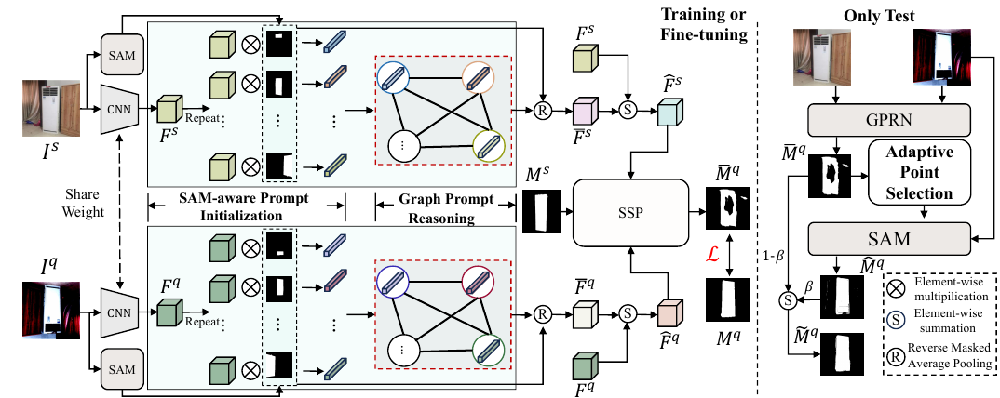

# [AAAI 2025] SAM-Aware Graph Prompt Reasoning Network for Cross-Domain Few-Shot Segmentation.

Shi-Feng Peng，[Guolei Sun](https://scholar.google.ae/citations?user=qd8Blw0AAAAJ&hl=en), [Yong Li](https://scholar.google.com.hk/citations?user=HRBTJYYAAAAJ&hl=zh-CN) , [Hongsong Wang](https://scholar.google.com/citations?user=LzQnGacAAAAJ&hl=en) ,  [Guo-Sen Xie](https://scholar.google.com/citations?user=LKaWa9gAAAAJ&hl=en).

Welcome to the official PyTorch implementation repository of our paper SAM-Aware Graph Prompt Reasoning Network for Cross-Domain Few-Shot Segmentation, accepted to AAAI 2025.


## Framework




## Requirements

Download training and testing datasets for evaluation.

### Source domain: 

* **PASCAL VOC2012**:

    Download PASCAL VOC2012 devkit (train/val data):
    ```bash
    wget http://host.robots.ox.ac.uk/pascal/VOC/voc2012/VOCtrainval_11-May-2012.tar
    ```
    Download PASCAL VOC2012 SDS extended mask annotations from [[Google Drive](https://drive.google.com/file/d/10zxG2VExoEZUeyQl_uXga2OWHjGeZaf2/view?usp=sharing)].

### Target domains: 
* **Deepglobe**:
  
    Home: http://deepglobe.org/

    Direct: https://www.kaggle.com/datasets/balraj98/deepglobe-land-cover-classification-dataset   

    Data Preprocessing Code: Please refer [preprocess_deepglobe.py](https://github.com/niejiahao1998/IFA/tree/master/data/preprocess_deepglobe.py) or [PATNet repo](https://github.com/slei109/PATNet).

* **ISIC2018**:
  
    Home: http://challenge2018.isic-archive.com

    Direct (must login): https://challenge.isic-archive.com/data#2018

    Class Information: data/isic/class_id.csv

    Data Preprocessing Code: Please refer [preprocess_isic.py](https://github.com/niejiahao1998/IFA/tree/master/data/preprocess_isic.py) or [PATNet repo](https://github.com/slei109/PATNet).

* **Chest X-ray**:
  
    Home: https://www.ncbi.nlm.nih.gov/pmc/articles/PMC4256233/

    Direct: https://www.kaggle.com/datasets/nikhilpandey360/chest-xray-masks-and-labels

* **FSS-1000**:
  
    Home: https://github.com/HKUSTCV/FSS-1000

    Direct: https://drive.google.com/file/d/16TgqOeI_0P41Eh3jWQlxlRXG9KIqtMgI/view
    
    

### Pre-trained Weight

 Download pre-trained ResNet models  and SAM weights.

[SAM base version weight](https://dl.fbaipublicfiles.com/segment_anything/sam_vit_b_01ec64.pth)

[Pre-trained ResNet model weight](https://drive.google.com/drive/folders/1oeDfNks2ToOlsDlMArozLx2z2l1QDP51)


### Generating SAM Masks

To save time, we have saved the masks generated by SAM to a file during actual operations, so you don’t need to regenerate them every time . You only need to run `generate_mask.py` to generate them once. Note that you should reconfigure the configuration such as file path and GPU ID in `generate_mask.py` .

```
python generate_mask.py
```


## File Organization

```
GPRN/
|--dataset/
|  |--Deepglobe/
|  |  |--01_train_ori/
|  |  |--...
|  |  |--04_train_cat/
|  |  |--|--Deepglobe-SAM_mask/          # Masks generated by SAM
|  |--FSS-1000/
|  |  |--ab_wheel/
|  |  |--...
|  |  |--FSS-SAM-MASK/                   # Masks generated by SAM
|  |--ISIC/
|  |  |--ISIC2018_Task1-2_Training_Input/
|  |  |--...
|  |  |--ISIC-SAM-MASK/                  # Masks generated by SAM
|  |--LungSegmentation/
|  |  |--CXR_PNG/
|  |  |--...
|  |  |--Lung-SAM-MASK/                  # Masks generated by SAM
|  |--VOC2012/
|  |  |--JPEGImages/
|  |  |--...
|  |  |--SAM-PASCAL/                     # Masks generated by SAM
```


## Evaluate our models
Please run the script file run.sh to evaluate our models.  Here is an example on Deepglobe dataset:

```
CUDA_VISIBLE_DEVICES=0 python -W ignore test.py \
  --dataset deepglobe --data-root ./dataset \
  --backbone resnet50 --batch-size 6 --shot 1 --refine --positive_point 20 --negative_point 20 --alpha 0.5 --fuse_method coff \
  --post_refine
```


## Related Repositories

This repository is built upon the foundations of [Segment Anything](https://github.com/facebookresearch/segment-anything), [MGCL](https://github.com/LiShuo1001/MGCL), [IFA](https://github.com/niejiahao1998/IFA), [VRP-SAM](https://github.com/syp2ysy/VRP-SAM), [MaskSLIC](https://github.com/benjaminirving/maskSLIC). We are very grateful for their contribution!


